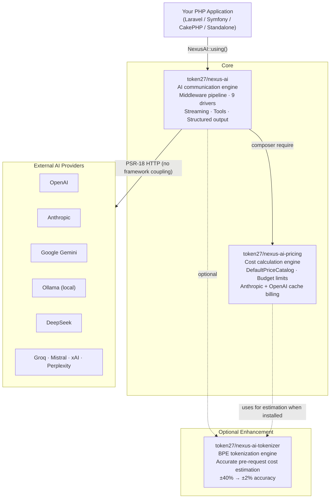
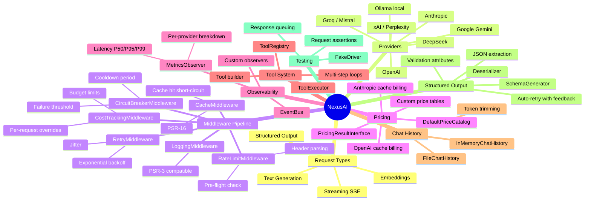
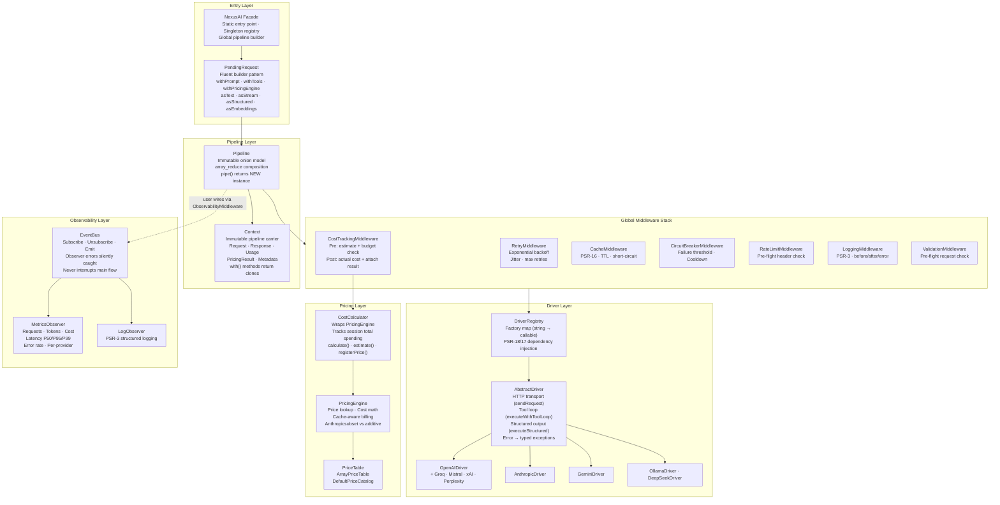
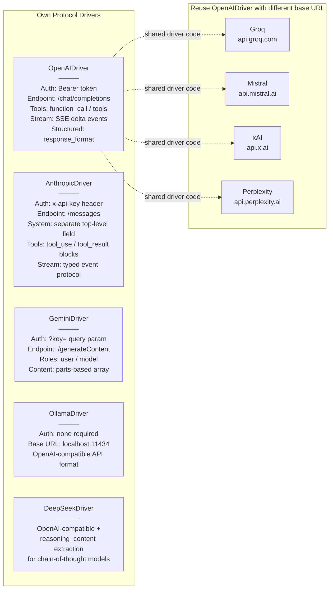
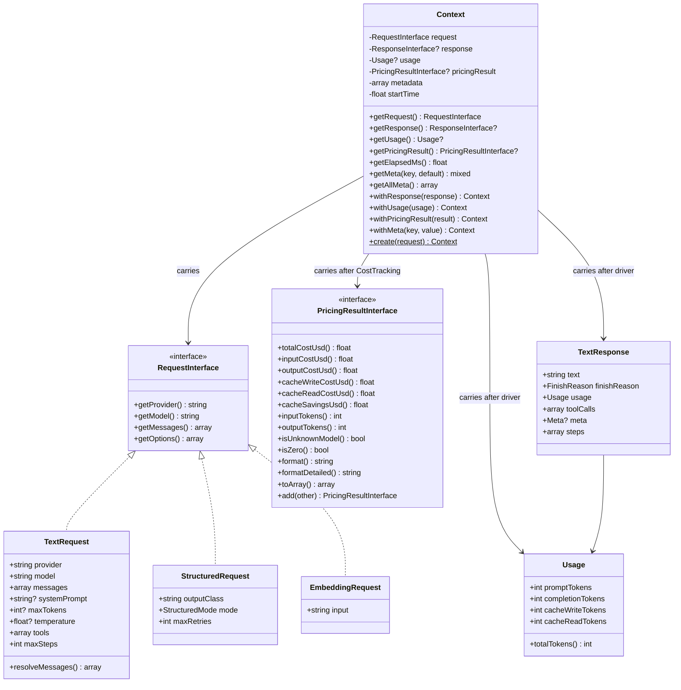

# Architecture & Component Map

Visual reference for NexusAI's static structure: library dependencies, internal components, and provider wiring. For runtime flows, see [Request Lifecycle →](request-lifecycle.md).

---

## Library Ecosystem

Three focused libraries form the NexusAI ecosystem. `token27/nexus-ai-pricing` is a **required** dependency. `token27/nexus-ai-tokenizer` is **optional** — it improves pre-request cost estimation from ±40% (character-based) to ±2% (BPE token-based).

---

## Feature Mind Map

A bird's-eye view of everything NexusAI provides:

---

## Internal Component Architecture

---

## Provider Driver Matrix

Nine providers are supported. Five have their own driver with distinct protocol implementations. Four are OpenAI-compatible and reuse `OpenAIDriver` with a different `baseUrl`.

---

## Context: The Immutable Pipeline Carrier

`Context` is the single object that flows through the entire middleware stack. Each `with*()` method returns a **new clone** — no middleware can mutate another's state.

---

> **← Back:** [Documentation Index](README.md) · **Next:** [Request Lifecycle →](request-lifecycle.md)
