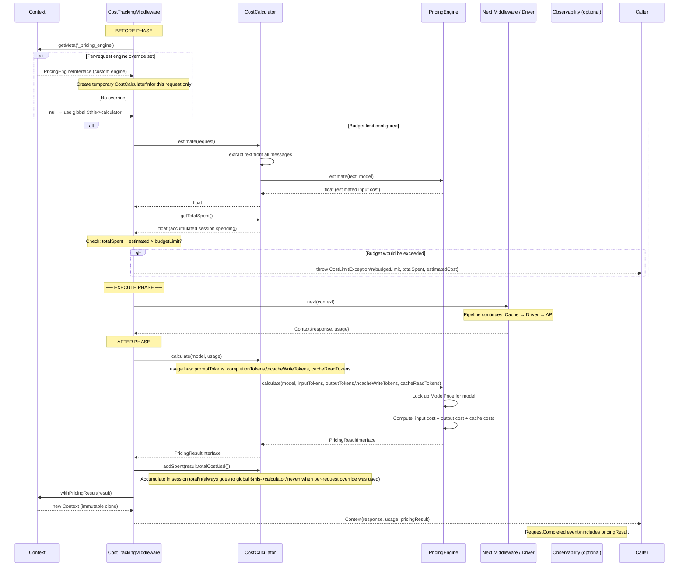
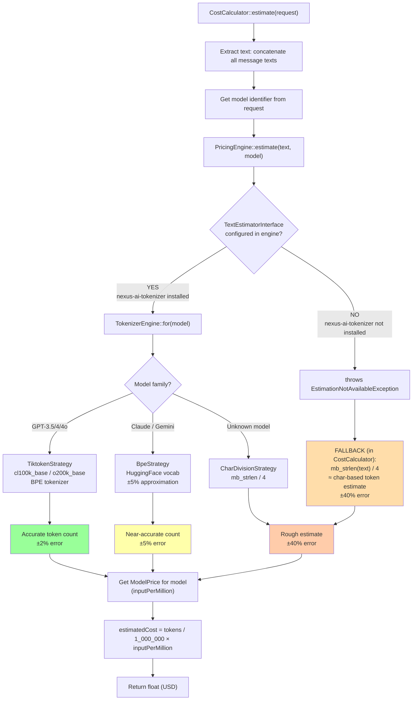
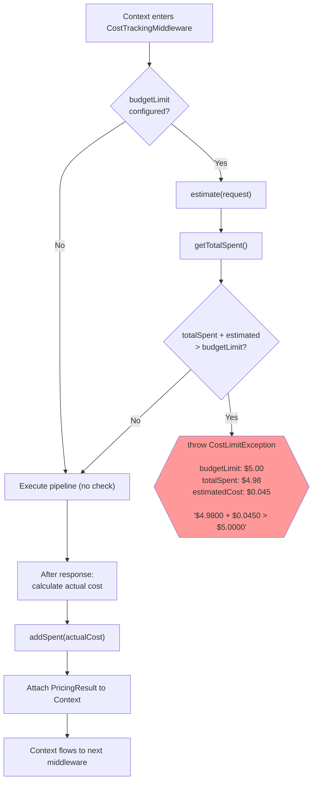
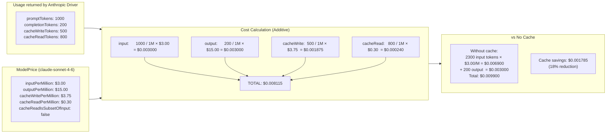
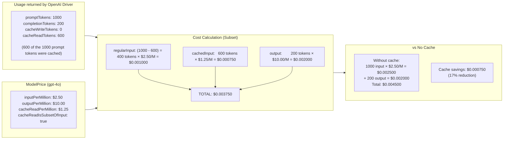
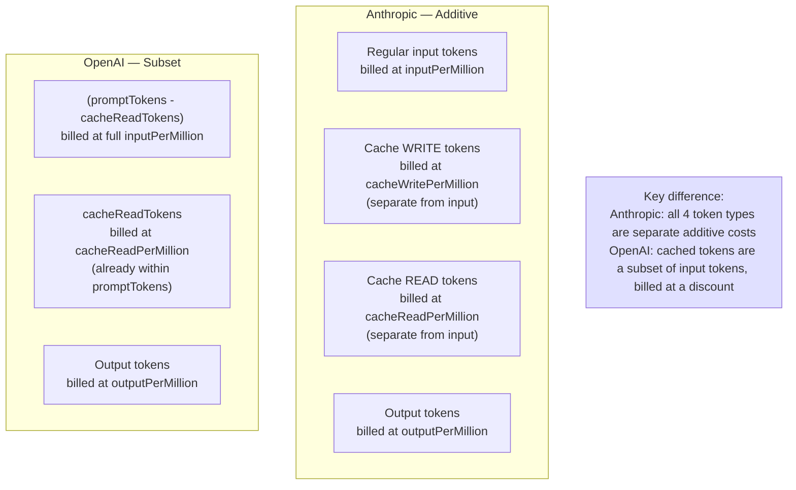
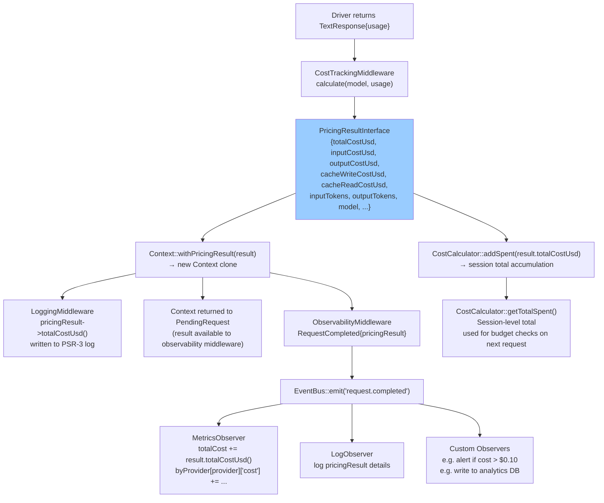
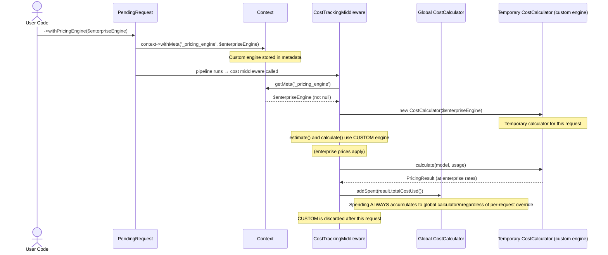
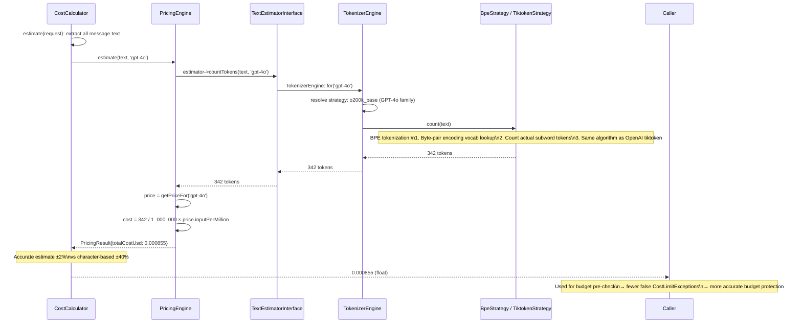
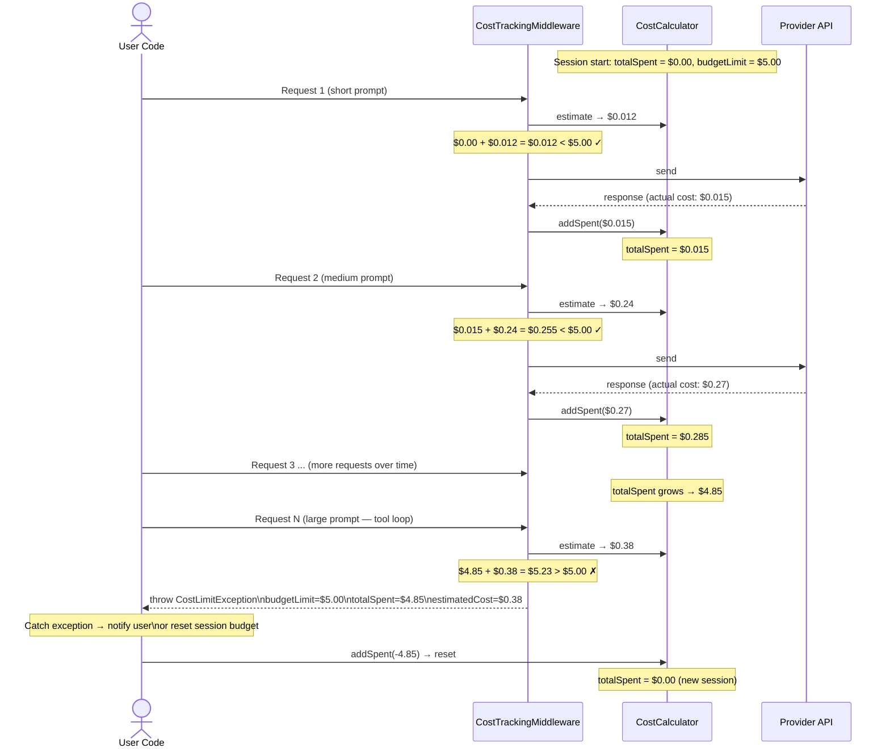

# Pricing & Cost Flow

Visual reference for how cost calculation works at runtime: the `CostTrackingMiddleware` lifecycle, pre-request estimation with and without a tokenizer, budget enforcement, and how Anthropic vs OpenAI handle cache token billing differently.

For static architecture context, see [Architecture →](architecture.md). For the request lifecycle, see [Request Lifecycle →](request-lifecycle.md).

---

## CostTrackingMiddleware Full Lifecycle

`CostTrackingMiddleware` runs in two phases: **BEFORE** (estimation + budget guard) and **AFTER** (actual cost calculation + spending accumulation). The `PricingResult` is attached to `Context` and flows to the `RequestCompleted` observability event.

---

## Pre-Request Cost Estimation Decision Tree

Before sending a request, `CostCalculator::estimate()` tries to get an accurate token count. If `nexus-ai-tokenizer` is **not** installed, it falls back to a character-based approximation (`mb_strlen / 4`).

---

## Budget Enforcement Decision Tree

---

## Anthropic Cache Token Billing (Additive Model)

Anthropic's prompt caching uses **additive** billing: cache write and cache read tokens are billed **in addition** to regular input tokens. They each have separate per-million rates.

---

## OpenAI Cache Token Billing (Subset Model)

OpenAI's prompt caching uses a **subset** model: cached tokens are **already included** within `promptTokens`. The pricing engine avoids double-counting by substituting the cached portion at the lower cached rate.

---

## Billing Models Comparison

---

## PricingResult Data Flow Through the System

How a single `PricingResultInterface` object travels from calculation to every consumer:

---

## Per-Request Engine Override Flow

When `->withPricingEngine($customEngine)` is called, the custom engine is stored in context metadata and read by `CostTrackingMiddleware::resolveCalculator()`:

---

## Tokenizer Integration (Future Enhancement)

When `token27/nexus-ai-tokenizer` is installed and configured in `PricingEngine`, pre-request estimation becomes significantly more accurate. This diagram shows the extended flow:

---

## Session Budget Lifecycle

A full session showing how multiple requests accumulate spending and eventually trigger the budget limit:

---

> **← Back:** [Request Lifecycle](request-lifecycle.md) · **Next:** [Architecture →](architecture.md)
