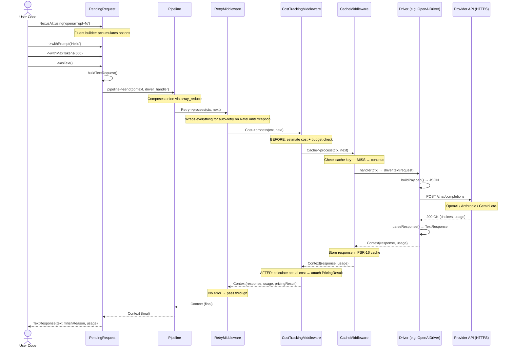
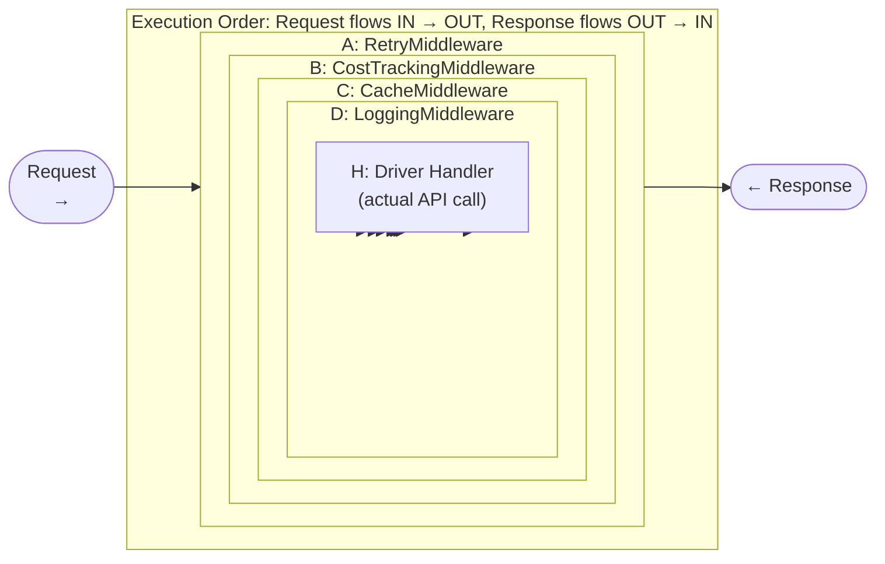
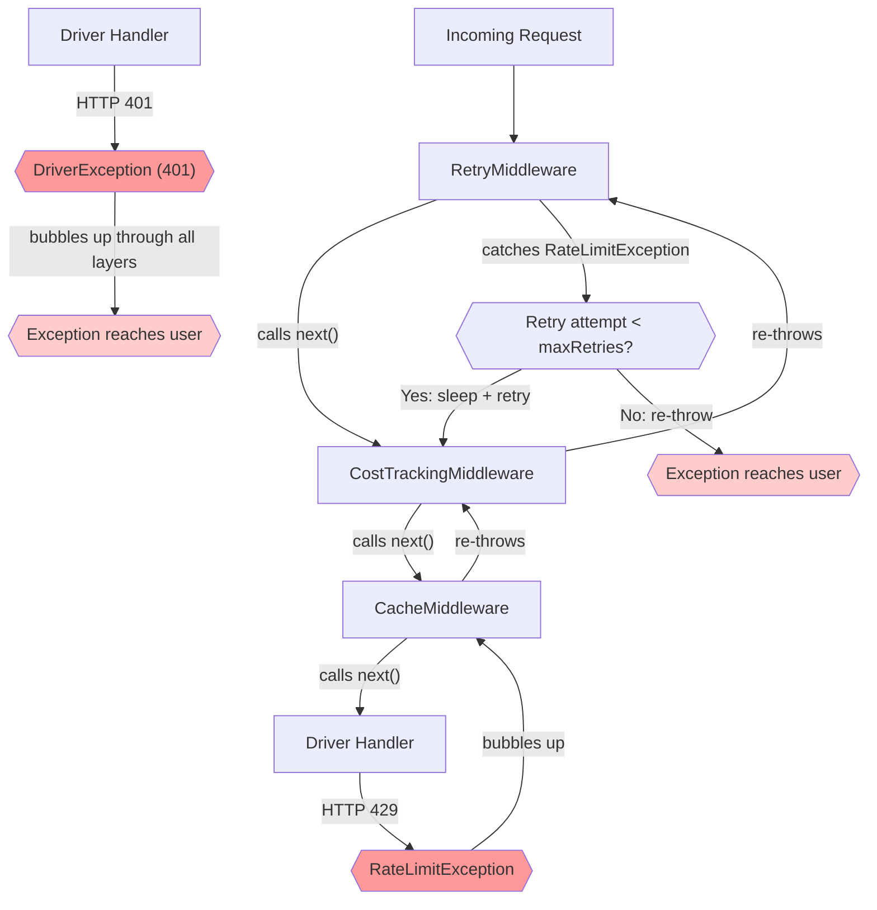
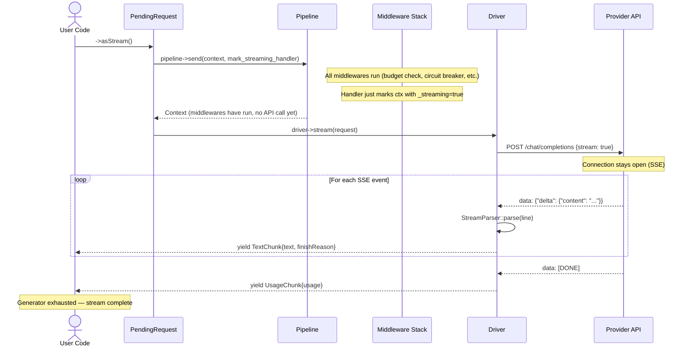
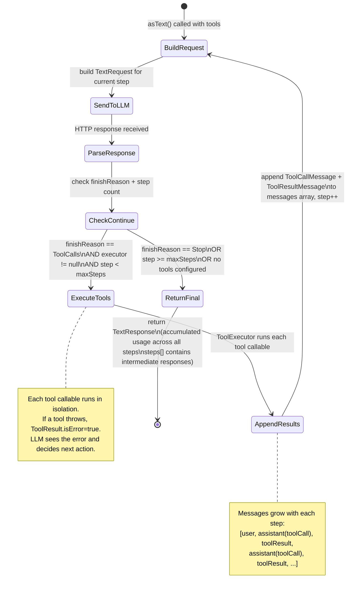
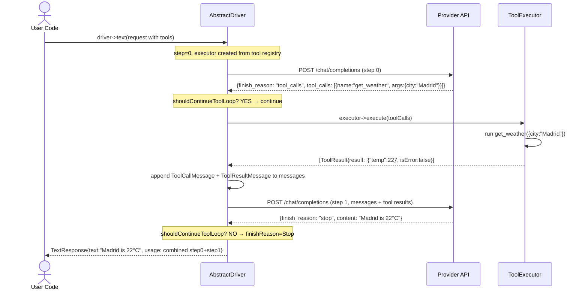
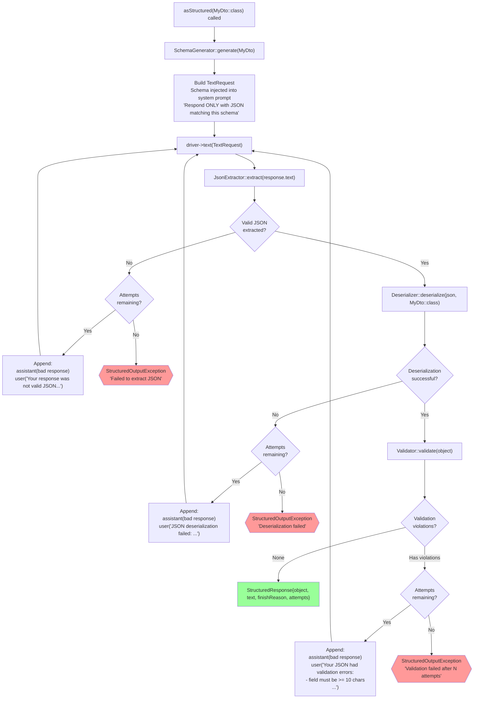
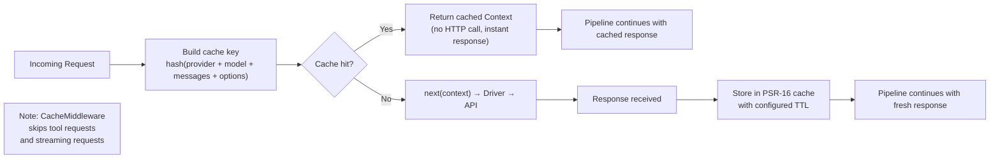
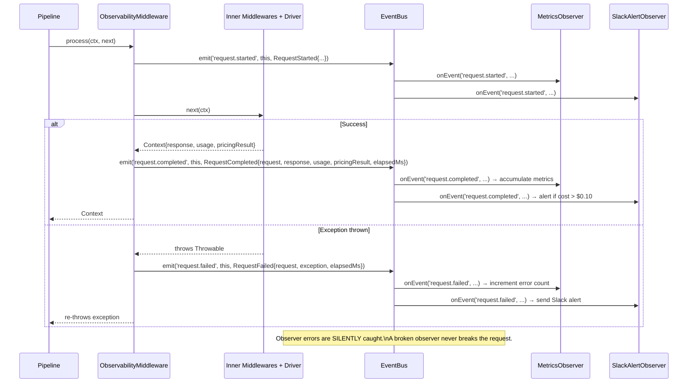

# Request Lifecycle

Visual reference for how requests flow through NexusAI at runtime: from user code to the provider API and back through the middleware stack. For static structure, see [Architecture →](architecture.md). For pricing flows, see [Pricing Flow →](pricing-flow.md).

---

## Full Text Request Lifecycle

The complete journey of a `asText()` call from user code through the middleware onion, driver, HTTP, and back:

---

## Middleware Onion Execution Model

The pipeline composes middlewares using `array_reduce(array_reverse($middlewares), ...)`. The result is a nested callable — middleware `A` wraps `B` which wraps `C` which wraps the driver handler `H`:

Each middleware calls `$next($context)` to pass control inward. On the way back out, each middleware can inspect or modify the context (e.g., `CostTrackingMiddleware` attaches `PricingResult` on the return trip).

---

## Error Propagation Through Middleware

What happens when an exception is thrown at any layer:

---

## Streaming Request Flow

Streaming differs from regular requests in one critical way: the pipeline runs **before** streaming begins, so middlewares (CostTracking, CircuitBreaker, etc.) can inspect and block the request. The generator itself runs **outside** the pipeline.

**Key difference from regular requests:** Cost tracking does NOT automatically run for streams (no `Usage` returned mid-stream). If you need cost tracking for streams, collect the stream with `$stream->collect()` then inspect `usage`.

---

## Tool Calling Loop

When tools are configured, the driver enters an automatic multi-step loop. Each iteration: LLM responds with tool calls → executor runs the tools → results are appended → next LLM call.

### Tool Loop Sequence (Detailed)

---

## Structured Output Pipeline

`asStructured(MyDto::class)` adds a retry loop with LLM feedback. The driver uses reflection to generate a JSON Schema and sends it as a system prompt instruction.

---

## Cache Hit vs Cache Miss

When `CacheMiddleware` is in the stack, a deterministic cache key is computed from the request. On a hit, the driver is never called.

---

## Observability Integration Pattern

`EventBus` is not wired into the pipeline by default. To emit `RequestCompleted`/`RequestFailed` events, add an observability middleware:

---

> **← Back:** [Architecture](architecture.md) · **Next:** [Pricing Flow →](pricing-flow.md)
